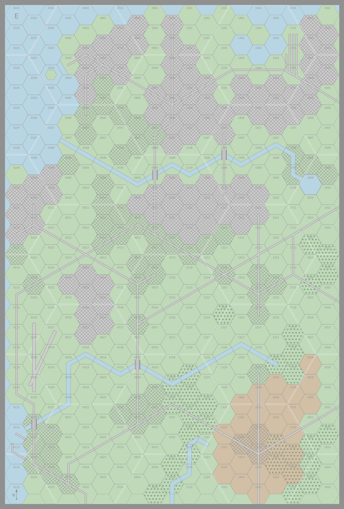

# Maps

This document discusses the origin, design choices, and implementation of the map in APXO.

The terms “map sheet” or just “sheet” are used to refer to the individual map sheets and “map” to refer to the whole space defined by the particular selection and arrangement of map sheets.

## Original Map Sheets

The original map sheets come in two generations. The first-generation sheets are those from *Air Superiority*, *Air Strike*, and *Eagles of the Gulf*. The second-generation sheets are from *The Speed of Heat*. The two generations differ in size, labeling, terrain features along their edges, and the graphical representation of terrain features.

### *Air Superiority*

*Air Superiority* came with four identical map sheets, referred to as sheets A to D. Barbie Pratt designed the sheets for GDW. They are uniformly blue with no terrain, only a hex and mega-hex grid. They are 25 hexes high and 20 hexes wide (8.3 by 5.8 miles).

### *Air Strike*

*Air Strike* came with six map sheets, labeled E to J. Again, Barbie Pratt designed the sheets for GDW.
They are the same size and have the same hex labeling as the Air Superiority map sheets.

The style is typical of GDW games of the epoch. The terrain is light green, with hills shown in two shades of brown, with the darker shade indicating higher elevation. The contrast is high. Villages are shown as block buildings on the terrain, and towns are shown as a continuous texture against a gray background. The maps include airfields, rail yards, docks, bridges, and a tunnel.

Sheets F to J are all land. Sheet E has a shoreline on two sides. The color of the water matches the blue used in the Air Superiority maps, so these can be used to extend the map offshore. Apart from this, as long as the sheets are arranged so that long edges abut other long edges and short edges abut other short edges, the terrain features flow from one sheet to the other.

### *Desert Falcons*

Desert Falcons did not provide any new map sheets but used the existing ones from Air Superiority and Air Strike.

### *Eagles of the Gulf*

*Eagles of the Gulf* appeared in issue 9 of *Battleplan* magazine and volumes 11 and 12 of *Air Power Journal*. It introduced four new sheets, labeled K, L, M, and N. Sheets K and L were published in *Battleplan*. Sheet N was published in volume 11 of *Air Power Journal*. Sheet M seems to have never been published and is only referenced in scenario EOG-23. It is not clear who designed these sheets, but the credits in *Battleplan* give “special thanks to Tony Valle for help on the maps”.

These sheets are printed in black and white. Sheets K and L represent desert terrain. Sheet N represents a stretch of the Suez Canal. 

These sheets are largely compatible with the Air Strike map sheets. One minor exception is that the roads leaving the top and bottom of sheet N do not match those in sheets E to L.

### *The Speed of Heat*

*The Speed of Heat* came with six map sheets, labeled A1, A2, B1, B2, C1, and C2. Rick Barber designed the sheets for Clash of Arms.

These second-generation sheets are smaller than the first-generation map sheets, being 15 hexes high and 20 hexes wide (5.0 by 5.8 miles). 

The design is recognizable as a development of the GDW style. The lowest terrain is shown in light green and the first level of hills in brown, but a second level of hills is added in a medium green. These maps have a lot more texture, for example, in the farmland, rivers, forests, and buildings. Villages, towns, and cities no longer seem to have distinct representations.

All the sheets show terrain. As befitting its subject, the urban area and river in map sheet A2 represent Hanoi and the Red River.

Again, as long as the sheets are arranged so that long edges abut other long edges and short edges abut other short edges, the terrain features flow from one sheet to the other. However, they do not match the first-generation sheets.

## APXO Maps

### Generations

Putting aside the question of the graphical representation of terrain features, first- and second-generation map sheets differ in their size, the geographic features along their edges, and in hex labeling. For these reasons, APXO allows games to be played on maps using sheets either from the first or the second generation, but not a mixture of generations.

### First-Generation Sheets

APXO implements twenty-six first-generation sheets labeled A to Z:

- A to D: These are adaptations of the original four sheets from *Air Superiority*.

- E to J: These are adaptations of the original six sheets from *Air Strike*. 

- K to N: These are adaptations of the original four sheets from *Eagles of the Gulf*, but sheet M currently does not have terrain features. Also, some of the roads in sheet N have been adjusted to match the other sheets. 

- O to Z: These are twelve new sheets, currently all land at level 0 with no other terrain features. They are for future expansion.

Any number of first-generation sheets can be used at once. When arranged in an approximately square grid, twelve are 80 hexes wide by 75 hexes high (about 27 miles by 25 miles). Adding additional first-generation sheets to the implementation would be quite easy.

The following are thumbnail images of the first-generation map sheets; click on them to see higher-resolution versions.

&nbsp;&nbsp;&nbsp;

&nbsp;&nbsp;&nbsp;

&nbsp;

&nbsp;&nbsp;&nbsp;

&nbsp;&nbsp;&nbsp;

&nbsp;&nbsp;&nbsp;

&nbsp;&nbsp;&nbsp;

### Second-Generation Sheets

APXO implements twelve second-generation sheets labeled *XY*, in which *X* is one of the letters from A to D and *Y* is one of the numbers from 1 to 6:

- A1, A2, B1, B2, C1, and C2: These are adaptations of the original sheets from *The Speed of Heat*. 

- A3, B3, and C3: These are duplicates of A1, B1, and C1. Scenario V-25 in *The Speed of Heat* requires two copies of sheet C1; use sheets C1 and C3 instead.

- A4 to A6, B4 to B6, and C4 to C6, D1 to D6: These are twelve new sheets, currently all land at level 0 with no other terrain features. They are for future expansion.

Any number of the second-generation sheets can be used at once. When arranged in an approximately square grid, the twenty-four are 80 hexes wide by 90 hexes high (about 27 by 30 miles). Adding additional second-generation maps would be difficult, as there is a mapping from hex codes *XXYY* to map sheet.

The following are thumbnail images of the second-generation map sheets; click on them to see higher-resolution versions.

&nbsp;&nbsp;&nbsp;

&nbsp;&nbsp;&nbsp;

&nbsp;&nbsp;&nbsp;

&nbsp;&nbsp;&nbsp;

&nbsp;&nbsp;&nbsp;

&nbsp;&nbsp;&nbsp;

### Map Sheet Arrangement

The arrangement of map sheets into a map is specified by a two-dimensional Python array containing strings specifying the sheets. The elements of the array form the rows and columns of a grid. For example, the map for scenario K-5 in *The Speed of Heat* has B1 in the upper left, C1 in the upper right, A1 in the lower left, and B2 in the lower right, and is specified as:

    [
      [ "B1", "C1" ],
      [ "A1", "B2" ],
    ]

The rows of the grid must have the same number of sheets. Missing or blank sheets can be specified as `""`, `"-"`, or `"--"`. For example, the map for scenario V-13 in *The Speed of Heat* is specified as:

    [
      [ "C1", "--" ],
      [ "B1", "C2" ],
      [ "A2", "B2" ],
      [ "A1", "--" ],
    ]

### Inverted Map Sheets

APXO allow any map sheet to be inverted by simply appending `"/i"` to the map sheet name. For example, the map for scenario V-11 of *The Speed of Heat* is specified as:

    [["A1"],["B2/i"],["B1"]]

Inverted map sheets are used in these scenarios:

- *Air Superiority*
  - None
- *Air Strike*
  - No information
- *Desert Falcons*
  - No information
- *Eagles of the Gulf*
  - EOG-11
  - EOG-16
  - EOG-18
  - EOG-19
  - EOG-21
  - EOG-23
- *The Speed of Heat*
  - V-11: B2
  - V-22: C1 and C2

Note that the inversion process inverts the terrain but *does not invert the hex grid*. One consequence of this is that care needs to be taken when an aircraft or ground units that are set up on an inverted sheet; the original hex code cannot be used directly.

### Oblique Map Sheets

APXO does not allow map sheets to be used at an oblique angle; they must be either in the normal orientation or inverted.

Oblique map sheets are used in these scenarios:

- *Air Superiority*
  - H-13
  - H-14
- *Air Strike*
  - No information
- *Desert Falcons*
  - No information
- *Eagles of the Gulf*
  - EOG-4
  - EOG-7
  - EOG-8
  - EOG-20
- *The Speed of Heat*
  - None

## Terrain Representation and Style

### Considerations

Maps are an important element of the physical game. Their role in the game mechanics is to determine positions and ranges, to indicate the altitude of terrain, to define air-to-ground targets such as bridges, and to confer terrain effects such as camouflage and cover on ground units. That said, if all we needed from the maps was to indicate the presence and spatial relation of the elements, a simple monochrome diagram would suffice. This would be miss using the map to stimulate the imagination of the players; the representation of Hanoi in map A2 of *The Speed of Heat* takes the players a step closer to reality.

These roles continue to a large degree in a digital realization of the game, but the design of digital maps is not identical to that of physical maps. It presents certain opportunities, but also certain challenges.

The main opportunity is that digital maps allow the creation of new map sheets beyond the limited number distributed with a physical game and permit variations of existing maps, changing colors and including or excluding certain terrain elements. Map sheets can be created for specific scenarios and adapted to more appropriately represent different terrain types.

One challenge comes from the realization that the focus of the game is the aircraft and other markers, so these must stand out clearly from the digital map. With a physical map, this is less of an issue as the counters contrast with the map in relief and texture. To achieve these aims, the digital maps in APXO deliberately have low contrast and saturation and the aircraft (typically) have higher contrast and saturation and are outlined in black  (A further specific challenges are that I am not a professional graphic designer and the tool I have at hand — the Python matplotlib package — was designed for creating scientific plots, not maps, and so lacks features such as textures and layers.)

With these considerations in mind, the implementation of the digital maps in APXO has the following features:

* The hex grid, hex labeling, and mega-hex grid is taken almost directly from the physical maps in the original games. 
    
* Higher terrain is indicated by darker colors, often darker tones of the same hue. This is not especially realistic; mountains in snowy tundra are not gray and mountains in forest do not typically have darker shades of vegetation. Nevertheless, it is a convention that is well-established in topographic maps.

* Several sets of base colors are implemented: two have shades of green, with one set darker than the other; one has shades of light brown; one has shades of white and gray; and one adapts the original *Air Strike* map colors, using green for level 0 and two shades of brown for altitudes level 1 and 2. (The scheme from *The Speed of Heat*, with light green for level 0, light brown for level 1, and dark green for level 2, is not adapted.)

* Rivers and lakes are indicated with light blue and outlined in a slightly darker blue. Seen from the air, these are typically darker colors, but this again defers to the convention established in topographic maps.

* For ease of implementation, each hex is associated with a single altitude level. (Map sheet C2 is therefore slightly modified to allow aircraft to fly down the valley along the river towards the dam at level 0.)

* Associating each hex with a single level gives the basic terrain a blocky feel. This is carried over into the design of wooded areas, urban areas, rivers, and roads.

* Cities and towns/villages are indicated by diagonal hatching. Cities have a gray background, but towns/villages use the background of the underlying terrain. This effectively means that cities are restricted to level 0, since there is no means to distinguish cities at levels 0, 1, and 2.

* Forests are indicated by filled green circles over the basic terrain.

* Hex labels are subdued compared to the physical maps, since positions can be given explicitly as arguments to the procedures that create aircraft and markers.

* The mega-hex grid has very little contrast with the basic terrain.

### Terrain Elements

Each map sheet is defined in terms of the following elements:
* whether hexes by default are land or water;
* land hexes at altitude levels 0, 1, and 2;
* ridgelines at altitude levels 0, 1, and 2;
* hexes with forests, villages/towns, and cities;
* rivers, wide rivers, lake hexes, and sea hexes;
* roads, trails, and road clearings;
* small and large bridges; and
* runways, taxiways, tunnels, docks, and dams.

When drawing map sheets, certain of these elements can be excluded or expanded.
The options for excluding or expanding elements are:

* All Water: All hexes are considered to be water hexes at altitude level 0.
* No Fresh Water: No rivers, lakes hexes, or bridges are drawn. Sea hexes are still drawn.
* Frozen: Water is drawn in the same color as altitude level 0 and is not outlined. This is intended to be used with the winter styles.
* All Forest. All hexes except water hexes and urban hexes are considered to be forest. Airfields are not drawn.
* Wilderness. No roads, trails, bridges, airfields, docks, or dams are drawn.
* Maximum Urban Size. No urban areas with more hexes than this limit are drawn. If it is 0, no urban areas are drawn. If it is 1, 2, 3, or 4, only urban areas consisting of that number of hexes are drawn. If it is 5 or more, all urban areas are drawn.

### Terrain Styles

This section describes and illustrates the thirteen map styles. Sheets A2, B1, and B2 are shown, with aircraft in map sheet B2 to illustrate their colors and the contrast with the map.

The first four map styles — original, temperate, tropical, and arid — have all the map elements present on the original maps, but differ only in their color schemes. They can be used for any of the scenarios that make reference to map features. The next two map styles — open water and sea ice — are distinguished by having no terrain features. The final size map styles — summer tundra, winter tundra, summer boreal forest, winter boreal forest, tropical forest, and desert — adapt the map sheets by removing or extending certain map elements. The air superiority style can be used to convert any map sheet into a terrainless one matching maps A to D from *Air Superiority*.

Beyond the comments above on the colors of higher terrain and rivers, there is much to criticize about these representations. For example, the representation of summer tundra lacks lakes. Nevertheless, this range of map styles is intended to shorten the leap of imagination between the game and reality. 

#### Original Style

This is an adaptation of the original *Air Strike* map design. The terrain colors are light green, light brown, and medium brown. All terrain elements are included.

#### Temperate Style

This is intended to represent terrain in temperate zones. The terrain colors are three shades of light to medium green. All terrain elements are included. This color palette is intended to be more evocative and less distracting than that of the original style. 

#### Tropical Style

This is intended to represent more verdant terrain in tropical zones. The terrain colors are three shades of medium green, and is darker than the temperate style. All terrain elements are included. This scheme is designed for the Vietnam scenarios in *The Speed of Heat*. 

#### Arid Style

This is intended to represent more arid terrain. The terrain colors are three shades of brown. All terrain elements are included. This scheme is designed for the scenarios in *Eagles of the Gulf*. 

#### Desert Style

This uses the same colors as the arid style, but is drawn as a wilderness with no urban hexes and no rivers. 

#### Tropical Forest Style

This is intended to represent a tropical forest. It has reduced urban areas, but is not wilderness. The colors are the same greens as the tropical style. It is drawn with urban areas with up to 4 hexes in size and all forest. 

#### Summer Tundra Style

This is intended to represent the treeless tundra of northern North America, Europe, and Asia in summer. The colors are the same greens as temperate. It is drawn as a wilderness with no urban hexes. 

#### Winter Tundra Style

This is the counterpart of summer tundra, but now in winter. The terrain colors are shades of gray, from almost white to a light gray. The lightest is the same color as used in “sea ice”. Again, it is drawn as a wilderness with no urban hexes. 

#### Summer Boreal Forest Style

This style is intended to represent boreal forest or taiga of northern North America, Europe, and Asia in summer. The terrain colors are the same greens as the tropical style. It is drawn as a wilderness with no urban hexes and all forest.  

#### Winter Boreal Forest Style

This is the counterpart of summer boreal forest, but now in winter. The terrain colors are the same grays as winter tundra. It is drawn as a wilderness with no urban hexes, all forest, and frozen water.

#### Open Water Style

This map style is intended to represent the ocean or sea. It is all water at level 0. The color is blue. 

#### Sea Ice Style

This map style is intended to represent Arctic sea ice. It is all ice at level 0. The color is white. 

#### Air Superiority Style

This style can be used to convert any of the other sheets into one that matches the *Air Superiority* maps A to D by eliminating all terrain and coloring the sheet with the same blue color. (It is implemented as an alias of the open water style.)

