# Map Styles

In Glass, a *map style* does two things: it determines how a map is rendered graphically and also can modify the terrain elements. The map style is specified when the game is started.

## Considerations

Maps play a crucial role in the game mechanics, serving to define positions, ranges, terrain altitudes, and fixed air-to-ground targets like bridges, while also indicating terrain effects such as camouflage and cover. While a simple monochrome diagram could suffice to represent thse spatial relationships and properties, such an approach would miss the opportunity to engage the players' imaginations. For instance, the depiction of Hanoi in map A2 of *The Speed of Heat* brings players closer to the reality of the setting.

In the digital version of the game, these roles largely persist, but the design of digital maps introduces both a new opportunity and a new challenge.

The new opportunity lies in the extensibility and flexibility of digital maps. The cost of implementing a new digital map is simply the effort required to design it, so new map sheets can be provided for specific scenarios. Furthermore, existing maps can be customized by altering colors or selectively including or excluding terrain elements, to better suit specific scenarios or represent diverse terrain types.

However, a key challenge arises from the need to ensure that aircraft and other markers remain visually distinct from the map. In physical maps, counters naturally stand out from the map due to their texture and relief. In digital maps, this distinction can be achieved by using low contrast and saturation for the map itself and higher contrast, higher saturation, and black outlining for aircraft and other markers.

With these considerations in mind, the implementation of the digital maps in Glass has the following features:

* The hex grid, hex labeling, and mega-hex grid are taken almost directly from the physical maps in the original games. 
    
* Higher terrain is indicated by darker colors, often darker tones of the same hue. This is not especially realistic; mountains in snowy tundra are not gray and mountains in forest do not typically have darker shades of vegetation. Nevertheless, it is a convention that is well-established in topographic maps.

* Several sets of base colors are implemented: two have shades of green, with one set darker than the other; one has shades of light brown; one has shades of white and gray; and one is an adaptation the original *Air Strike* map colors, using green for level 0 and two shades of brown for altitudes level 1 and 2. (The scheme from *The Speed of Heat*, with light green for level 0, light brown for level 1, and dark green for level 2, is not adapted.)

* Rivers and lakes are indicated with light blue and outlined in a slightly darker blue. Seen from the air, real rivers typically have darker colors, but this again defers to the convention established in topographic maps.

* For ease of implementation, each hex is associated with a single altitude level. (Map sheet C2 is therefore slightly modified to allow aircraft to fly down the valley along the river towards the dam at level 0.)

* Associating each hex with a single level gives the basic terrain a blocky feel. This is carried over into the design of wooded areas, urban areas, rivers, and roads.

* Cities and towns/villages are indicated by diagonal hatching. Cities have a gray background, but towns/villages use the background of the underlying terrain. This effectively means that cities are restricted to level 0, since there is no means to distinguish cities at levels 0, 1, and 2.

* Forests are indicated by filled green circles over the basic terrain.

* Hex labels are subdued compared to the physical maps, since positions can be given explicitly as arguments to the procedures that create aircraft and markers.

* The mega-hex grid has very little contrast with the basic terrain.

## Terrain Elements

Each map sheet is defined in terms of the following elements:
* whether hexes by default are land or water;
* land hexes at altitude levels 0, 1, and 2;
* ridgelines at altitude levels 0, 1, and 2;
* hexes with forests, villages/towns, and cities;
* rivers, wide rivers, lake hexes, and sea hexes;
* roads, trails, and road clearings;
* small and large bridges; and
* runways, taxiways, tunnels, docks, and dams.

When drawing map sheets, certain of these elements can be excluded or modified according to the map style. For example, the `tundra` style excludes forest hexes. In particular, when a style is described as *wilderness*, it excludes: villages, towns, cities, roads, trails, road clearings, bridges, runways, taxiways, tunnels, docks, and dams.

## Catalog of Styles

This section describes and illustrates the map styles. Sheets A2, B1, and B2 are shown, with aircraft in map sheet B2 to illustrate their colors and the contrast with the map.

### Original Map Styles

The `airsuperiority` and `airstrike` map styles are adapted from those in *Air Superiority* and *Air Strike*.

The `airsuperiority` style has a plain blue background. Additionally, it removes all terrain, and so can be used to convert any map sheet into one matching maps A to D; this can be seen below in sheets A2, B1, and B2.

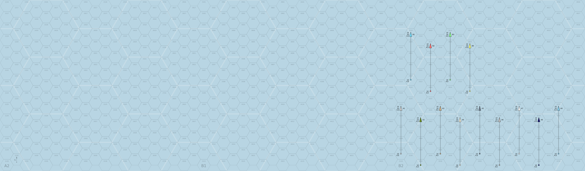

The `airstrike` style has terrain colors of light green, light brown, and medium brown. All terrain elements are included. This is the default style.

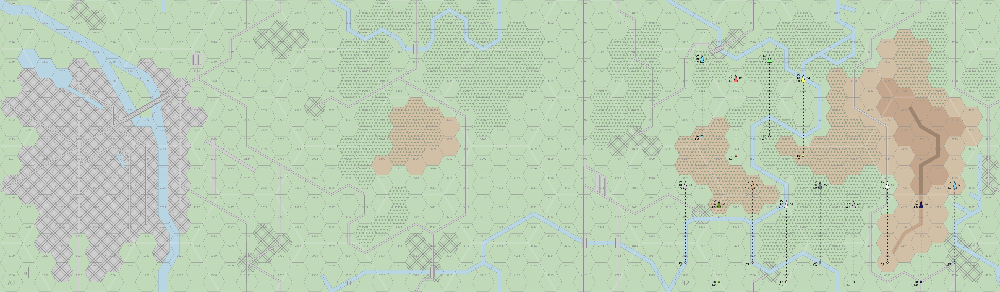

### Base Map Styles

The `water`, `temperate`, `temperateforest`, `tundra`, `borealforest`, `tropical`, `tropicalforest`, `arid`, and `desert` styles have color schemes and terrain adaptations appropriate for a range of different terrains.

Beyond the comments above on the colors of higher terrain and rivers, there is much to criticize about these representations. For example, the representation of summer tundra lacks lakes. Nevertheless, this range of map styles is intended to shorten the leap of imagination between the game and reality. 

The `water` style is intended to represent the ocean or sea. It removes all terrain The color is blue. 

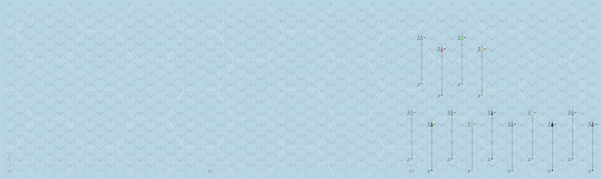

The `temperate` style is intended to represent terrain in temperate zones. The terrain colors are three shades of light to medium green. All terrain elements are included. This color palette is intended to be more evocative and less distracting than that of the original style. 

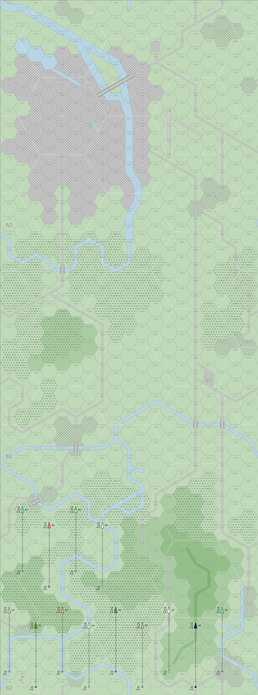

The `temperateforest` style is intended to represent forested terrain in temperate zones. It has reduced urban areas, but is not wilderness. The colors are the same greens as the temperate style. It is drawn with urban areas with up to 4 hexes in size and all forest.

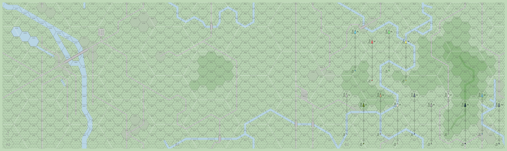

The `tundra` style is intended to represent the treeless tundra of northern North America, Europe, and Asia. The colors are the same greens as temperate. It is drawn as wilderness. 

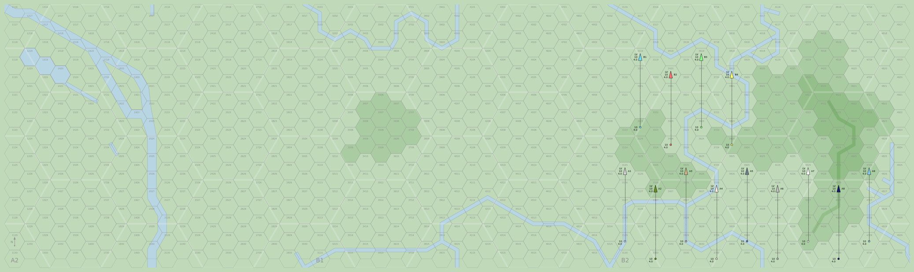

The `borealforest` style is intended to represent the boreal forest or taiga of northern North America, Europe, and Asia. The terrain colors are the same greens as the tropical style. It is drawn as a wilderness and all forest.  

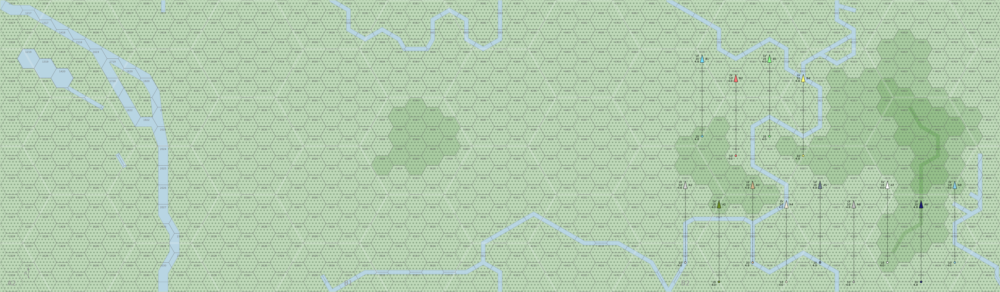

The `tropical` style is intended to represent more verdant terrain in tropical zones. The terrain colors are three shades of medium green, and are darker than the temperate style. All terrain elements are included. This scheme is designed for the Vietnam scenarios in *The Speed of Heat*. 

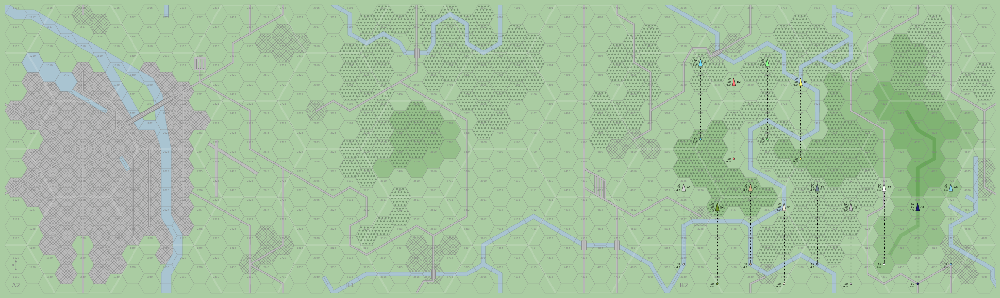

The `tropicalforest` style is intended to represent a tropical forest. It has reduced urban areas, but is not wilderness. The colors are the same greens as the tropical style. It is drawn with urban areas with up to 4 hexes in size and all forest. 

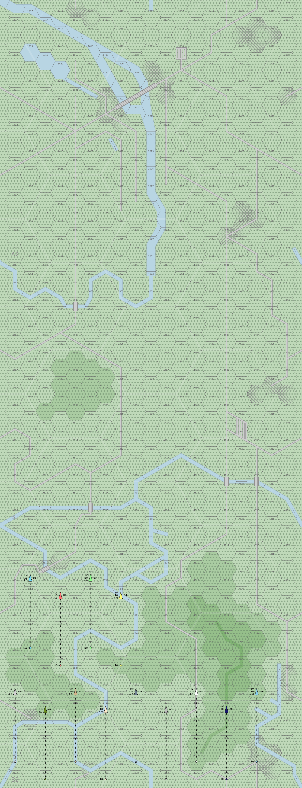

The `arid` style is intended to represent more arid terrain. The terrain colors are three shades of brown. All terrain elements are included, but the rivers are narrower. This scheme is designed for the scenarios in *Eagles of the Gulf*. 

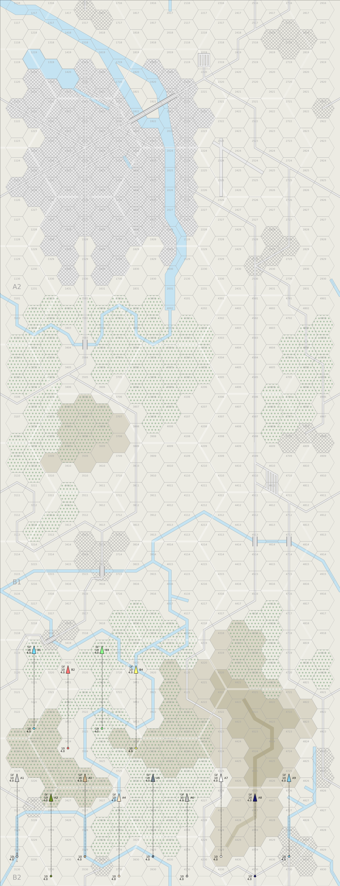

The `desert` style uses the same colors as the arid style, but is drawn as a wilderness and with no rivers. 

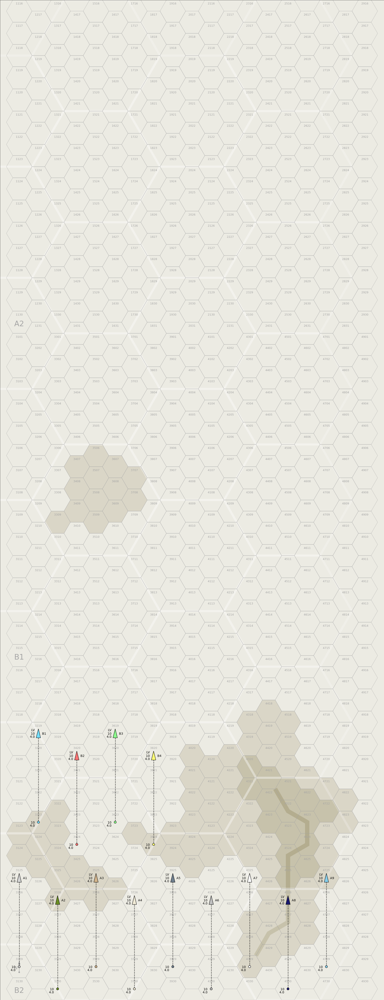

### Derived Styles

Additional derived styles can be adapted from any of the base styles by applying a prefix and/or a suffix.

- The possible prefixes are `snowy` or `frozen`.
- The possible suffixes are `hills`, `plain`, or `islands`.

The `snowy` prefix changes the color of the land to shades of gray, from almost white to a light gray, to represent snow. The `frozen` prefix is like `snowy`, but also draws fresh water in the same color as land, to represent frozen water.

The `hills` suffix reduces the height of elevated hexes and ridges by 1 level. Thus, ridges at level 0 are eliminated, hexes and ridges at level 1 become hexes and ridges at level 0, and hexes and ridges at level 2 become hexes and ridges at level 1. The `plain` suffix eliminates elevated hexes and ridges.

The `islands` suffix replaces level 0 hexes by water, converts level 1 hexes and ridges into level 0 hexes and ridges, converts level 2 hexes and ridges into level 1 hexes and ridges, and eliminates roads and dams.

There are thus eleven derived styles for each of the nine basic styles. Some of these combinations do not make much sense physically (such as `frozendesert`) or are effectively identical (such as all the styles derived from `water` except `frozenwater`), but are included nevertheless. Showing all 88 derived styles is not practical here, but the following are some particular examples.

The `snowytemperate` style could represent winter in Europe.

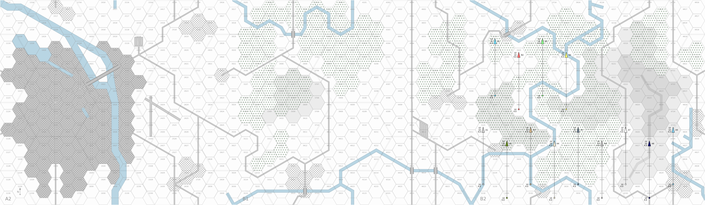

The `frozentundra` style could represent winter tundra.

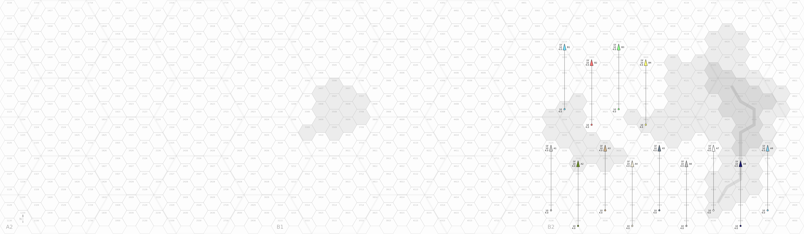

The `frozenborealforest` style could represent winter boreal forest or taiga.

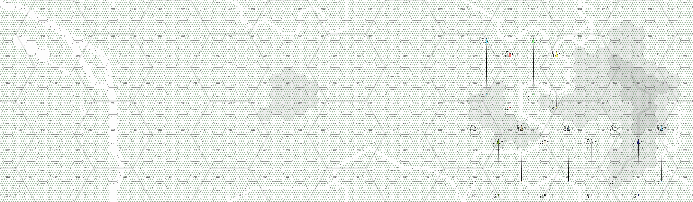

The `deserthills` style could represent desert, but with low relief.

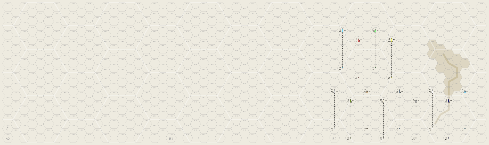

The `tropicalplain` style could represent the area around Hanoi and other parts of the Red River Valley in scenarios V-5, V-6, V-12, V-13, V-14, V-15, V-19, V-21, V-24, and V-25 in *The Speed of Heat*.

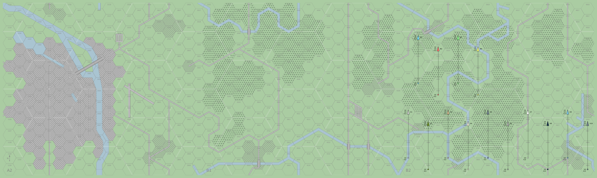

The `temperateislands` style could represent Aegean islands.

The `frozenwater` style could represent Arctic sea ice.

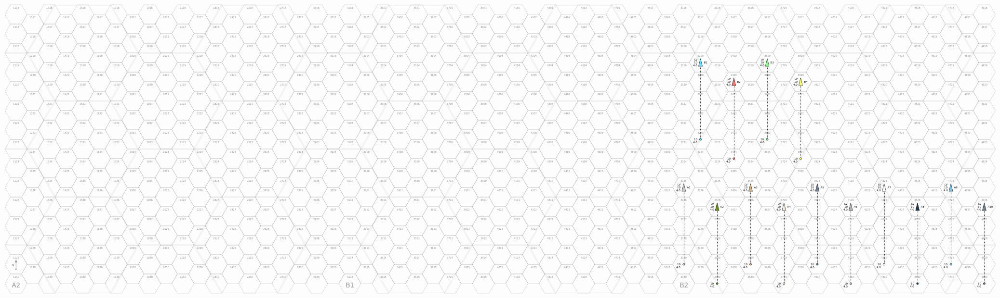